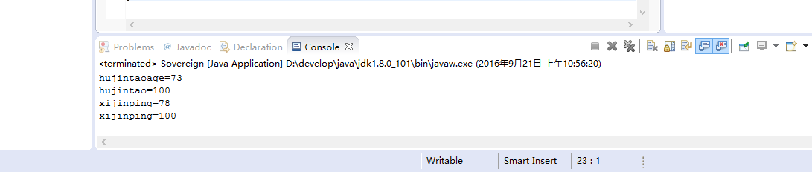

# 2016-9-21工作日志
========================

1. 应完成工作
 * java面向对象
2. 已完成工作
   * 1.  Soverign的用法
   * package text;

public class Sovereign {
	int age;
	static int power=100;
	public static void main(String[] ages){
		
		Sovereign hujintao=new Sovereign();
		hujintao.age=73;
		hujintao.power=70;
		
		Sovereign xijinping=new Sovereign();
		xijinping.age=78;
		Sovereign.power=100;
		
	
	System.out.println("hujintaoage="+hujintao.age);
	System.out.println("hujintao="+hujintao.power);
	System.out.println("xijinping="+xijinping.age);
	System.out.println("xijinping="+xijinping.power);
	}
}

3. 未完成工作
4. 未完成原因
5. 工作成功
 * 第一题
 
6. 遇到的问题及解决方法
